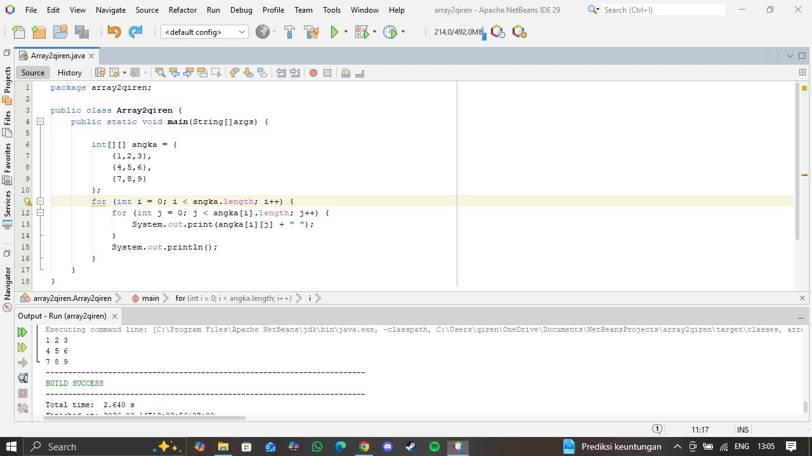

# Penjelasan Kode Program `Array2qiren.java`

## 1. Deklarasi Package dan Class

```java
package array2qiren;

public class Array2qiren {
```

- `package array2qiren` — mengelompokkan class ini ke dalam package bernama `array2qiren`
- `public class Array2qiren` — mendefinisikan class utama program

---

## 2. Method Main

```java
public static void main(String[] args) {
```

Titik awal eksekusi program Java.

| Bagian | Fungsi |
|--------|--------|
| `public` | dapat diakses dari luar class |
| `static` | dapat dijalankan tanpa membuat objek |
| `void` | tidak mengembalikan nilai |
| `main` | nama method utama |
| `String[] args` | parameter argumen dari command line |

---

## 3. Deklarasi Array 2 Dimensi

```java
int[][] angka = {
    {1, 2, 3},
    {4, 5, 6},
    {7, 8, 9}
};
```

- `int[][]` — tipe data array 2 dimensi bertipe integer
- `angka` — nama variabel array
- Array ini terdiri dari **3 baris** dan **3 kolom**, membentuk matriks 3x3

Ilustrasi matriks:

```
1  2  3
4  5  6
7  8  9
```

---

## 4. Looping Baris (for luar)

```java
for (int i = 0; i < angka.length; i++) {
```

- `i` — indeks baris, dimulai dari `0`
- `angka.length` — jumlah baris array (bernilai `3`)
- Loop ini berjalan sebanyak **3 kali** untuk setiap baris

---

## 5. Looping Kolom (for dalam)

```java
for (int j = 0; j < angka[i].length; j++) {
    System.out.print(angka[i][j] + " ");
}
```

- `j` — indeks kolom, dimulai dari `0`
- `angka[i].length` — jumlah kolom pada baris ke-`i` (bernilai `3`)
- `angka[i][j]` — mengakses elemen pada baris `i`, kolom `j`
- `System.out.print()` — mencetak nilai tanpa pindah baris, diikuti spasi

---

## 6. Pindah Baris

```java
System.out.println();
```

Dipanggil setiap kali looping baris selesai agar setiap baris matriks tampil di baris baru.

---

## Contoh Output Program



## Kesimpulan

Program ini berfungsi untuk:

1. Menyimpan data dalam bentuk **array 2 dimensi** (matriks 3x3)
2. Mengiterasi setiap elemen menggunakan **nested for loop**
3. Menampilkan isi array dalam format **baris dan kolom** ke layar
